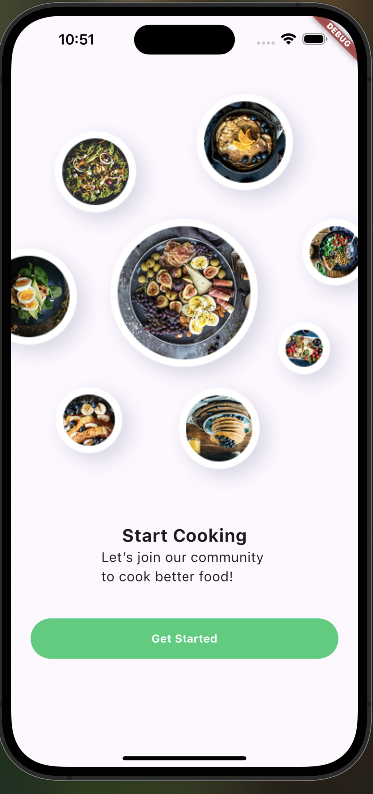
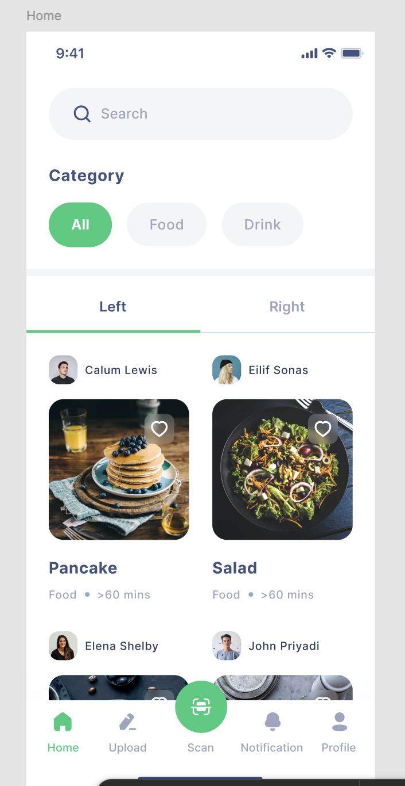
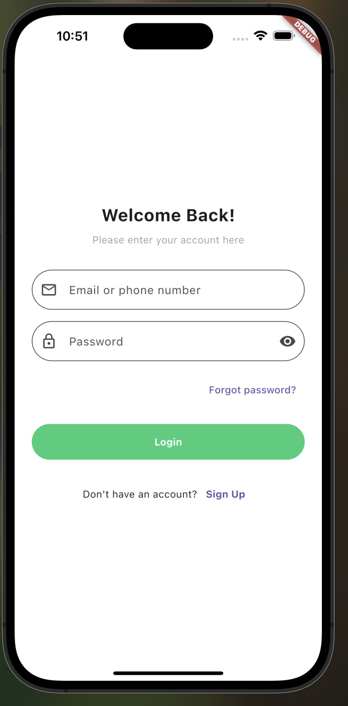
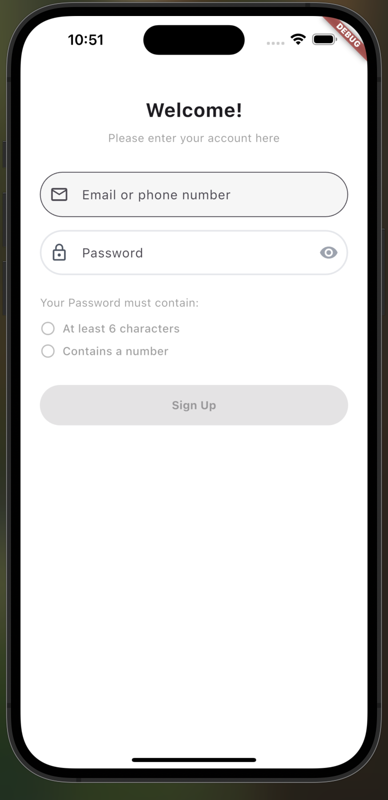
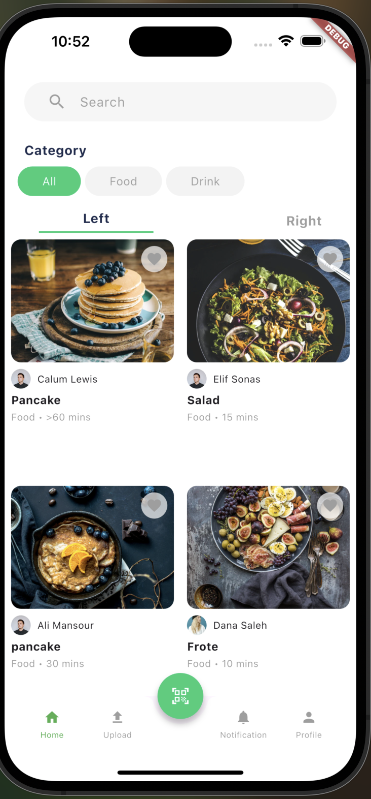
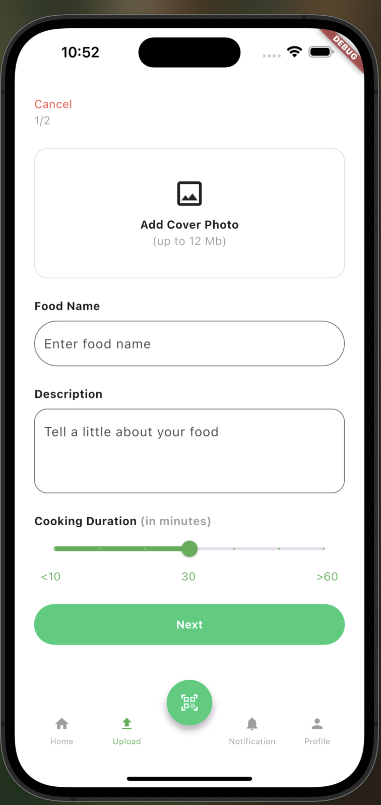
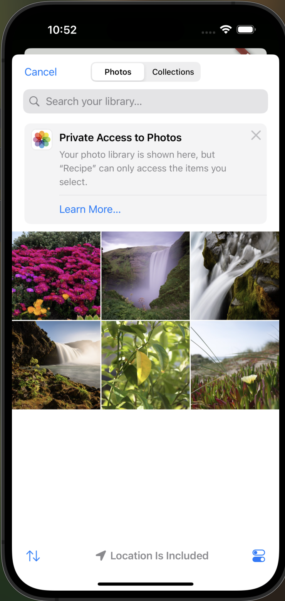
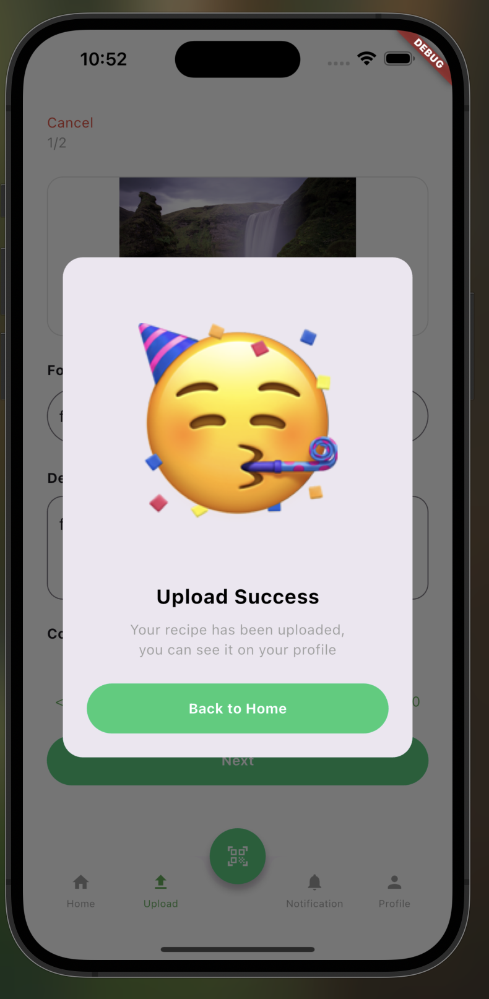
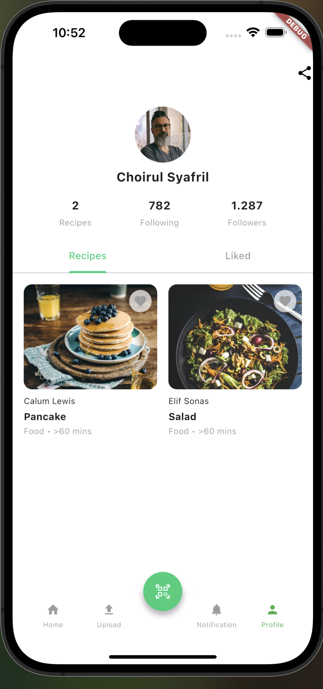
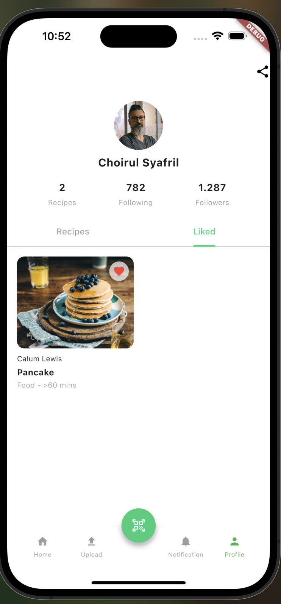

# s Recipe App

A minimal and modern recipe application built using **Flutter** and **BLoC** for state management.  
Users can browse recipes, like them, and upload their own – all wrapped in a beautiful UI matching the provided Figma design.

---

## = Features

### = Authentication
- Login screen
- Signup screen

### = Recipe Management (CRUD)
- **Create**: Upload a recipe with image and description
- **Read**: View all recipes on the Home screen
- **Like**: Favorite any recipe (heart button)
- **Read Liked**: View liked recipes in the Profile tab
- **Unlike**: Tap the heart again to remove from favorites

###  Design
- Fully matches the provided Figma file
- Modern UI with responsive layout
- Bottom navigation bar + FAB

### = State Management
- Powered by `flutter_bloc` for clean separation of UI & logic

---

##  Screenshots

###
  
  
  
  
  
  
  
  
  
  

##  Getting Started

### 1. Clone the repository

```bash
git clone https://github.com/your-username/recipe-app.git
cd recipe-app
2. Install dependencies
flutter pub get
3. Run the app
flutter run


Author :
Manaalq
github: Manaalq
