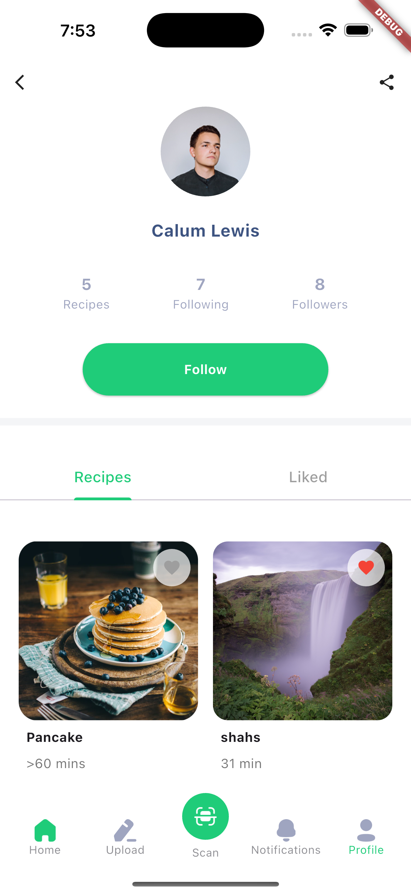

## Recipes Sharing App

A community-driven Flutter application where users can share and like recipes. The app features form validation for authentication, image uploading via ImagePicker, a sleek dotted border UI, state management with `flutter_bloc`, and a persistent bottom navigation bar using `persistent_bottom_nav_bar_v2`.

## Screenshots
### Onboarding Screen

 
### HoLoginme Screen


### signUp Screen


### Home Screen


### Upload Recipe Screen


### Profile Recipes Screen



### Profile Liked Recipes Screen


### Recipe Action Dialog


## Features

* **User Authentication**

  * Sign up and login with form validation (email/password, required fields).
* **Share Recipes**

  * Upload images of dishes using the `image_picker` package.
* **Like Recipes**

  * Toggle likes on recipes to curate your favorites.
* **Dotted Border UI**

  * Highlight recipe cards and upload areas with a dotted border using the `dotted_border` package.
* **State Management**

  * Built with the BLoC pattern (`flutter_bloc`) for predictable and testable behavior.
* **Persistent Navigation**

  * Seamless bottom tab navigation provided by `persistent_bottom_nav_bar_v2`.

## Tech Stack

* **Flutter** (>=3.0.0)
* **Dart**
* **flutter\_bloc** for state management
* **image\_picker** for image selection
* **dotted\_border** for dotted UI elements
* **persistent\_bottom\_nav\_bar\_v2** for bottom navigation

## Installation

1. **Clone the repository**

   ```bash
   git clone https://github.com/your-username/recipes_app.git
   ```

2. **Navigate into the project directory**

   ```bash
   cd recipes_app
   ```

3. **Install dependencies**

   ```bash
   flutter pub get
   ```

4. **Run the app**

   ```bash
   flutter run
   ```

## How to Use

1. **Sign Up / Login**

   * Use the bottom tabs to switch between Login and Sign Up.
   * All fields are validated before submission.

2. **Browse Recipes**

   * Explore the Home tab to view all shared recipes.

3. **Upload a Recipe**

   * Tap the **+** button in the center of the bottom nav bar.
   * Fill in recipe details and select an image.
   * Submit to share with the community.

4. **Like Recipes**

   * Tap the heart icon on any recipe card to add it to your liked list.

5. **View Profile and Liked Recipes**

   * Access your Profile tab to see your shared and liked recipes.

## Author

**Solaiman Al-Dokhail**
Software Engineering Student

---

Enjoy cooking and sharing! 🍴
