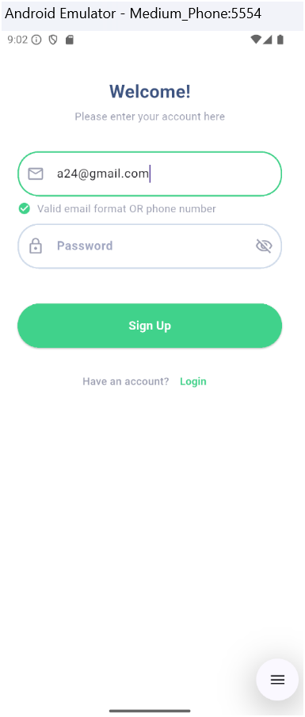

# 🍽️ Flutter Recipes App (with BLoC)

## Project Description
This Flutter application is designed for users to explore, upload, and manage recipes. The app features a user-friendly interface that allows users to:

### Key Features
Onboarding Screen: Introduces users to the app and guides them through the initial setup.

User Authentication:

Sign Up: Users can create accounts.
Login: Existing users can log in to access their profiles.
Profile Management:

Users can view and edit their profiles, including profile image and personal information.
Displays user statistics such as the number of recipes created, followers, and following.
Recipe Management:

Users can upload new recipes, including adding images, descriptions, and cooking durations.
Recipes can be liked and categorized.
Home Screen:

Features a search bar for easy navigation.
Displays a grid of recipes, allowing users to view details and like recipes.
Tab Navigation:

Allows switching between different sections: home, upload, scan, notifications, and profile.
State Management:

Utilizes BLoC (Business Logic Component) pattern for managing states across the app, including user authentication and recipe likes.

## Technologies Used

Flutter for cross-platform mobile development.
Dart as the programming language.
Provider and BLoC for state management.
Various packages for UI components and functionalities (e.g., image picker, dotted border).

## ⚙️ Setup Instructions

Clone the repository: Use the command line: git clone <Your Repository Path>

Install dependencies: Make sure you have Flutter installed. Then run: flutter pub get

Run the app: You can launch the app using: flutter run

Note: You need a working emulator or a connected real device

## 📱Screen Design Overview

### Onboarding Screen

### Login Screen

### SignUp Screen

### Home Screen

### Profile Screen

### Liked Food 

### Show Liked Food 

### Upload Recipe Screen

### Upload  success Screen

### My profile Screen After added Recipe

### My profile Screen After added Recipe To Liked

