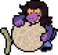

#  Recpies App 🥪🥧


Welcome for my all fellow cheif🧑‍🍳👩‍🍳

today I present to you our github for cooking our gathering
the place were the creation is unlimited, inifinty potentials !!!
An app where the chef can belong and share their experience.


---


---

## 📱 Features


- 🥧 **Add recpies** – You can share your masterpiece for the world to test and taste..
- ♥️ **Like Posts** – you can like the recpies that you tried to make them again later !!!
- 🔎 **Search** – You can look for your favorite food or recpie.
- 📚 **Filter** – You can filter by catagories to make it easier for you so you can cook while you are looking.
- 🖼️ **** – You have your own profile and the others can follow you and you can follow them too and share with them your amazing recpies !!!!.
- 📱 **Splash Screen** – A masterpiece beautiful splash screen that you want to watch while cooking.
- 🫶 **Amazing UI** – The most masterpiece that created with passion.

---

## 📦 Packages

 [Flutter Bloc](https://pub.dev/packages/flutter_bloc)
 [Dotted Border](https://pub.dev/packages/dotted_border)
 


---

---

## 💻 Tech

- **Flutter** 
- **Dart**
 

---
## 💻 installation

1-All you have to do is to install dart and flutter from [HERE](https://dart.dev/get-dart).

2- download [Android Studio](https://developer.android.com/studio?hl=ar) to play the emulator or you can use any emulator you like.

3-  Clone the repo from me
```
git clone https://github.com/AymanAlzahrani/recipes-app.git
 ```


4- go to the cloned repo on your preffered location
```
 cd desktop/recpies-app/project5
```
5- now enter this line to open VSCode like magic 🪄🪄
```
code .
```

6- run this code to run the program and get ready be ready to make the people eat their finger from happenies with your recpies
```
flutter run
```

7- make a cup of tea because you made it (or coffee) form the app recpies ☕🍵  


---

## ✨ Written by Ayman Alzahrani

plaese if you have any suggestions contact me <a href="mailto:aymangormallah@gmail.com">Here.</a>


This app was a real challenge programming wise and Food wise,I couldn't resist myself to eat food and leave the project onhold.


 


